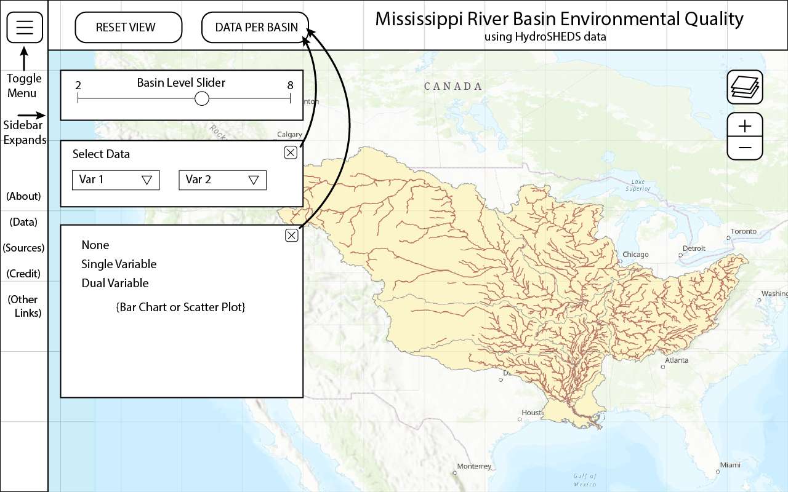

# Team Name
Geog575_FinalProject_Mississippi-River-Basins

### Team Members
1. Jessica Steslow
2. Jack Plasterer

### Final Proposal
1. Project Summary
2. Persona/Scenario
    1. Persona
    2. Scenario
3. Requirements Document
    1. Representation
    2. Interaction
4. Wireframes

---

## 1. Project Summary
We propose creating a dashboard website that explores environmental data associated with drainage basins of the Mississippi River in central USA. We would like to create a large interactive map that lets the user see the full extent of the Mississippi River drainage system and zoom into specific sub-basins to look at data per basin, using data from HydroSHEDS, an environmentally focused global watershed database. We would like the user to be able to select datasets to show on a choropleth map of the sub-basins with an adjacent chart or set of charts that summarize the data. We would like to include the option to include a bivariate analysis.

## 2. Persona/Scenario

### i. Persona:

Text

### ii. Scenario:

Text

## 3. Requirements Document

### i. Representation:

Each basemap tileset or context overlay:  

| Title of layer (abbreviated) | Description of source | Description of symbolization |
| --- | --- | --- |
| Basemap of USA | Natural Earth | Neutral base layer |
| Watersheds of the Mississippi River | HydroSHEDS | Distinct borders, fill color based on data |

### ii. Interaction

Each unique interface widget:  

| Title of function (abbreviated) | Coding by operator and operand | Description of behavior and UI design |
| --- | --- | --- |
| Map scaled to Miss. watershed extent | Zoom, Pan | Allows user to explore the extent |
| Datasets per sub-basin | Overlay | User selects which data to display via choropleth on map |

## 4. Wireframes

Wireframe for web: 

 
Wireframe for mobile: 

