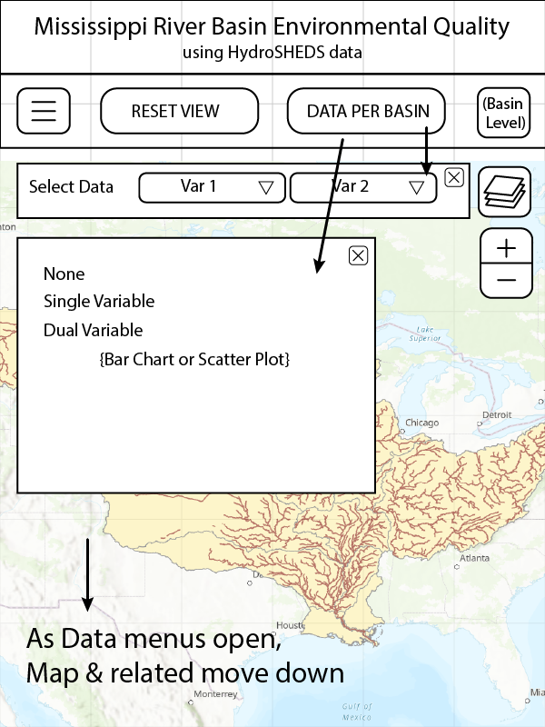

# Team Name
Geog575_FinalProject_Mississippi-River-Basins

### Team Members
1. Jessica Steslow
2. Jack Plasterer

### Final Proposal
1. Project Summary
2. Persona/Scenario
    1. Persona
    2. Scenario
3. Requirements Document
    1. Representation
    2. Interaction
4. Wireframes

---

## 1. Project Summary
We propose creating a dashboard website that explores environmental data associated with drainage basins of the Mississippi River in central USA. We would like to create a large interactive map that lets the user see the full extent of the Mississippi River drainage system and zoom into specific sub-basins to look at data per basin, using data from HydroSHEDS, an environmentally focused global watershed database. We would like the user to be able to select datasets to show on a choropleth map of the sub-basins with an adjacent chart or set of charts that summarize the data. We would like to include the option to include a bivariate analysis.

#### Note
Note that hydroSHEDS database delineates sub-basins basd on where two river branches meet which each have an individual upstream area of at least 100 km^2. This concept is applied to basins across the global dataset. For this reason, hydroSHEDS basins are NOT the same as the U.S. Geological Survey delineation of basins in the USA with the Hydrologic Unit Code (HUC). 

## 2. Persona/Scenario

### i. Persona:

The user for this application is a scientific minded professional who is interested in learning about parameters for water quality in the Mississippi River basin, or interested in learning about watershed science in general. The user is familiar with GIS interfaces, but perhaps not a professional in the watershed science space. The user is interested in looking for patterns in the data in order to learn about watersheds. While the analysis focuses on the midwest USA, the represented data is NOT associated with the USGS HUC basins, which a water professional in the US would be familiar with. A US water professional is likely not familiar with the hydroSHEDS database.

### ii. Scenario:

The user is interested in exploring the menus and different variables to apply to the map. The user may experiment with the basin slider to see how basins and sub-basins are defined at different levels (Larger basin level corresponds to more sub-basins). The user may be interested to explore the data definitions and summary presented in the sidebar. The user may select different variables to display on the map, and may explore the map for spatial patterns. Additional layers are provided in the layer menu if the user is interested in more visual context (state labels, comparing to HUC basins). There is a RESET VIEW button in case the map gets too busy.

## 3. Requirements Document

### i. Representation:

Each basemap tileset or context overlay:  

| Title of layer (abbreviated) | Description of source | Description of symbolization |
| --- | --- | --- |
| Basemap of USA | Natural Earth | Neutral base layer |
| Simple terrain basemap of oceans, USA, Mexico, Canada | Open Street Map | Neutral but enough detail to show variations in terrain | 
| Watersheds and sub-basins of the Mississippi River | HydroSHEDS | Distinct borders, fill color based on data |
| The Mississippi River and tributaries | HydroSHEDS | Simple line data for reference overtop watersheds. Optional display. |
| USGS HUC Basins | USGS/data.gov or EPA | Simple polygon outlines with no fill, for comparison against hydroSHEDS basins. Optional display. |
| USA state boundaries and labels | Natural Earth | Simple reference layer, outline of polygons with no fill. Optional display. |
| River labels | Customized with general research | Simple text labels for Miss. and main tributaries. Optional display. |

### ii. Interaction

Each unique interface widget:  

| Title of function (abbreviated) | Coding by operator and operand | Description of behavior and UI design |
| --- | --- | --- |
| Map scaled to Miss. watershed extent | Zoom, Pan | Allows user to explore the extent with expected mouse behavior: click&drag, scroll wheel |
| Datasets per sub-basin | Overlay | User selects which data to display via choropleth on map |
| Layers button | Overlay | User selects data to add or remove from map |
| +/- button | Zoom | User can zoom map by clicking on +\- buttons |
| Menu toggle button (top left corner) | Overlay | Opens and closes side bar. Sidebar is opened over map and data panels. |
| Reset View button | Arrange | Resents map zoom level and extent, does not change layers |
| Data Per Basin button | Overlay | Button brings data view menus back to the screen |
| Basin Level Slider | Reexpress | User can select which basin level dataset to view on the map |
| Select Data dropdowns | Retrieve/Resymbolize | User can choose "no data" or select a variable, for each dropdown. The map will update with basin color dependant on the data, and a chart below the menus will describe the data. |
| X button on data menus | Arrange | Allows user to close menus when not wanted |
| Links on sidebar | Overlay | Opens contextual information for user to read |
| Mouse hover over basins | Overlay | Hovering over basins will display a tooltip that describes the data for the individual basin |

## 4. Wireframes

Wireframe for web: 

!(img/MissBasins_Wireframes-web_menus.png)
!(img/MissBasins_Wireframes-web_sidebar.png)
 
Wireframe for mobile: 

